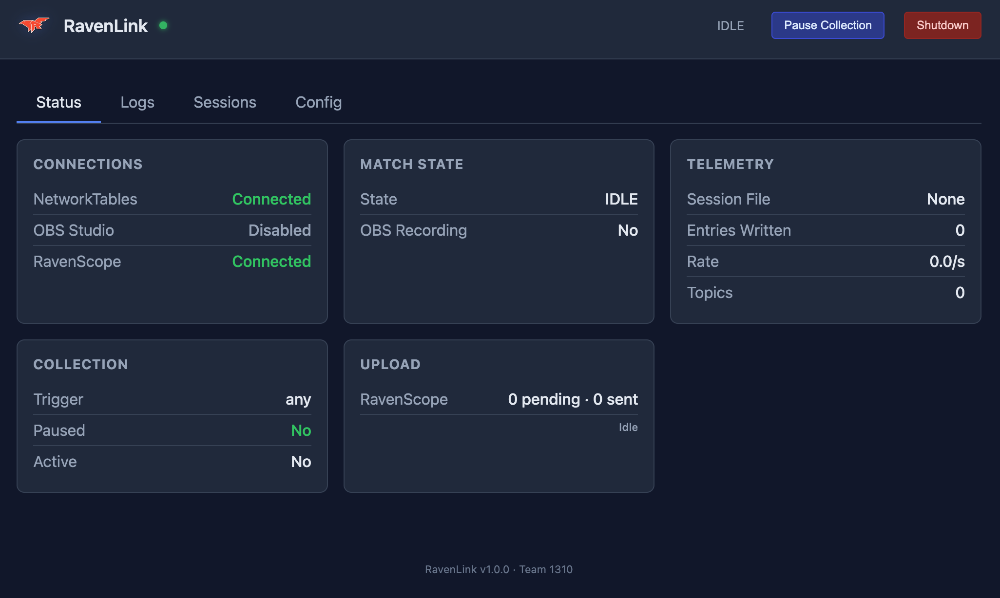
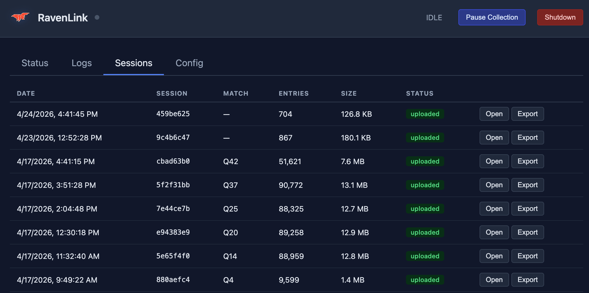

# RavenLink

**Driver-station companion for FRC robot data.** A single native
binary that captures NetworkTables telemetry, controls OBS recording,
monitors Limelight uptime, and uploads match data to
[RavenScope](https://github.com/RunnymedeRobotics1310/RavenScope) (or
[RavenBrain](https://github.com/RunnymedeRobotics1310/RavenBrain)) for
post-match review.

Out of the box, RavenLink is preconfigured for
**[ravenscope.team1310.ca](https://ravenscope.team1310.ca)** — sign
in there, mint an API key, paste it into RavenLink, and you're
streaming match data with no other setup.

## Features

- **NetworkTables capture** — subscribes to configurable path
  prefixes; logs every value change to JSONL with timestamps. Speaks
  NT4 natively over WebSocket + MessagePack, no NetworkTables
  toolchain required.
- **OBS auto-record** — auto-starts and stops OBS recording based on
  FMS match state (or manual / practice mode). Three trigger modes
  cover competition, practice, and freeform driving.
- **Limelight uptime monitor** — polls each Limelight's `/results`
  endpoint so you can distinguish "rebooted mid-match" from "lost
  network to the camera" in post-match review.
- **Store-and-forward upload** — every JSONL is saved locally first,
  then fanned out to every enabled destination. A down server
  doesn't block a healthy one; nothing is lost on power-off or
  network loss.
- **Web dashboard** at `http://localhost:8080` — live status, log
  viewer, session browser, config editor, restart/shutdown buttons.
  Auto-opens in your browser on launch.
- **Embedded AdvantageScope export** — convert any session to
  `.wpilog` and open directly in AdvantageScope from the dashboard.
- **System tray icon** — connection status, "Open Dashboard", "Quit"
  from the menu bar (macOS) or system tray (Windows/Linux).
- **First-run wizard** — ships with no team configured. On first
  launch the dashboard opens a config form; saving restarts
  RavenLink with the new values automatically.
- **Launch on login** — registers itself so it starts when you boot
  the driver-station laptop.
- **Simulator-friendly** — point at a WPILib simulator with one
  config setting. Loopback addresses are treated as secure so a
  local dev server "just works".

Built in Go. Single ~14 MB static binary. No runtime dependencies
(no Python, no .NET, no JVM).

## Interface

The browser dashboard at `http://localhost:8080` is the primary
control surface — live status, log viewer, session browser, and
config editor, all in one tab-driven UI. It auto-opens on launch
and is also reachable from the system tray icon.



### Sessions tab — works without internet



Every recorded session is listed here with row-level actions:

- **Open in AdvantageScope** — converts the session's JSONL to
  `.wpilog` and opens it in AdvantageScope on this driver-station
  laptop directly.
- **Download .wpilog** — saves the converted file to disk for
  archival, sharing, or opening on another machine.

Both actions run **entirely on the local machine** and do not need
RavenScope, RavenBrain, or any internet connection. This is the
fallback path when the DS is offline at competition: pit-crew
review between matches, classroom debrief later, or any time you
want to inspect a session on the same laptop that captured it.

When the DS does have connectivity, the same sessions also show up
in your RavenScope workspace once they finish uploading — but
nothing in the local AdvantageScope flow depends on that.

## Prerequisites

- **OBS Studio 28+** with WebSocket server enabled
  (Tools → WebSocket Server Settings)
- **Windows 10/11** or **macOS 12+** (Linux works for development)

That's it.

## Install

Download the latest release for your platform from
[GitHub Releases](https://github.com/RunnymedeRobotics1310/RavenLink/releases):

- **Windows** — `ravenlink.exe`
- **macOS** — `RavenLink.app` (drag to `/Applications`)
- **Linux** — `ravenlink` binary

Or build from source: see [DEVELOPMENT.md](docs/DEVELOPMENT.md).

## Quick start

```bash
# Linux / macOS (terminal)
./ravenlink --team 1310

# macOS (.app bundle, recommended for menu bar icon)
open RavenLink.app

# Windows
ravenlink.exe --team 1310
```

On first launch, RavenLink writes a template config file to your
OS-standard app directory and opens the dashboard at
`http://localhost:8080`. Fill in your team number and (if you want
match data uploaded) your RavenScope API key, click Save. RavenLink
restarts itself with the new config.

To get a RavenScope API key:

1. Sign in at [ravenscope.team1310.ca](https://ravenscope.team1310.ca).
2. Open **API Keys** in the top navigation.
3. Click **Create API key**, give it a name, and copy the
   `rsk_live_…` value.
4. Paste it into RavenLink's dashboard → Config → `ravenscope.api_key`.

That's the whole setup.

## How it works

### NT data collection

RavenLink subscribes to the configured NetworkTables path prefixes
(always including `/FMSInfo/`) and writes every value change as a
JSON line to a session file. Session files are named
`{ISO-timestamp}_{hex8}.jsonl`. Match start/end markers with FMS
metadata are embedded in the data stream.

### Match state machine

```
IDLE → RECORDING_AUTO → RECORDING_TELEOP → STOP_PENDING → IDLE
```

- **IDLE → RECORDING_AUTO**: trigger condition met (per
  `record_trigger` config — `fms`, `auto`, or `any`).
- **RECORDING_AUTO → RECORDING_TELEOP**: auto mode ends, teleop
  starts (brief disable gap tolerated).
- **RECORDING_TELEOP → STOP_PENDING**: robot disabled.
- **STOP_PENDING → IDLE**: after `stop_delay`, OBS recording stops.

Both `record_trigger` (OBS recording) and `collect_trigger` (NT
data logging + upload) support the same three modes and can be set
independently:

| Mode | Trigger | Use case |
|------|---------|----------|
| `fms` | FMS attached + enabled | Competition matches (default) |
| `auto` | Auto mode + enabled | DS Practice button, manual auto enables |
| `any` | Any robot enable | Any enable triggers recording/collection |

### Store and forward

Completed JSONL files are uploaded to every enabled destination (one
or both of RavenScope and RavenBrain). Each target uses the same
five-step protocol: authenticate → upsert session → check server's
`uploadedCount` → batch entries → mark complete. Per-target
`.done` sidecar markers track progress; a file moves from
`data/pending/` to `data/uploaded/` only after every enabled target
has accepted it.

A target that's down doesn't block a healthy one — backoff is
per-target. Re-attempts are idempotent thanks to server-side
`uploadedCount`, so a process restart never produces duplicate
entries.

Zero enabled targets = local-only mode: files stay in
`data/pending/` and no network traffic happens.

### Limelight uptime monitor

RavenLink polls each configured Limelight camera once per second and
emits two synthetic NT topics into the same session JSONL:

- `/RavenLink/Limelight/<octet>/uptime_ms` — the Limelight's
  reported time since boot.
- `/RavenLink/Limelight/<octet>/reachable` — `true` if the poll
  succeeded, `false` otherwise.

In AdvantageScope, plot `uptime_ms` as a line chart — in a healthy
session it grows monotonically, with clean downward resets at
reboots. Plot `reachable` as a digital signal — every dip to `false`
marks a network outage.

This separates two failure modes that look identical from the robot
code's perspective:

| What happened | How it shows up |
|---|---|
| **Limelight rebooted** (power glitch, firmware crash, manual reset) | `uptime_ms` drops between adjacent samples; `reachable` stays `true` |
| **Network outage** (Ethernet unplugged, radio dropout, switch died) | `reachable` flips to `false`; no `uptime_ms` updates during that stretch |

## Pointing at a different server

By default RavenLink uploads to **`ravenscope.team1310.ca`**. To use
a different RavenScope instance (your own self-hosted one) or to add
a parallel RavenBrain target, edit the dashboard's Config tab or
`config.yaml` directly.

```yaml
# RavenScope (bearer API key). Bundled default points at team1310's
# hosted instance; change `url` to point at your own deployment.
ravenscope:
  enabled: true
  url: https://ravenscope.team1310.ca
  api_key: rsk_live_…
  batch_size: 50
  upload_interval: 10

# RavenBrain (legacy /login JWT). Independent of ravenscope —
# both can run in parallel, either alone, or neither.
ravenbrain:
  enabled: false
  url: ""
  username: telemetry-agent
  password: ""
  batch_size: 50
  upload_interval: 10
```

A target is "active" when `enabled: true` AND its `url` is non-empty.
Both can run in parallel. Zero targets = local-only.

## Config file location

RavenLink searches for `config.yaml` in this order:

1. `$RAVENLINK_HOME/config.yaml` (env override)
2. `./config.yaml` in the current working directory
3. OS-standard app directory:
   - **macOS**: `~/Library/Application Support/RavenLink/config.yaml`
   - **Windows**: `%APPDATA%\RavenLink\config.yaml`
   - **Linux**: `$XDG_CONFIG_HOME/ravenlink/config.yaml` or
     `~/.config/ravenlink/config.yaml`

Logs go to the OS-standard log location (`~/Library/Logs/RavenLink/`,
`%LOCALAPPDATA%\RavenLink\`, or `~/.cache/ravenlink/`). When
launched from a terminal, logs also stream to stdout.

The full set of config knobs is documented in `config.yaml.example`
at the repo root. Any config setting can also be overridden by CLI
flag — run `ravenlink --help` for the full list.

## Troubleshooting

**OBS not detected**
Ensure OBS is running with WebSocket server enabled (Tools →
WebSocket Server Settings). If you set a password in OBS, set
`obs_password` in config.

**NetworkTables not connecting**
Verify team number is correct. Ensure the DS laptop can reach the
robot at `10.TE.AM.2`. Check firewall allows outbound connections
to port 5810.

**Recording doesn't start**
Check `record_trigger`. The default `fms` requires FMS attached.
For home practice, use `record_trigger: auto` (DS Practice button)
or `any`.

**Data not uploading**
Check the dashboard Connections card. "Upload targets: None
configured" means no target is both `enabled: true` AND has a
non-empty `url`. RavenScope: verify `api_key` is a valid
`rsk_live_…` token. RavenBrain: verify `username` and `password`
for the service account.

**Menu bar / system tray icon missing**
- **macOS**: launch the `.app` bundle, not the raw binary. The raw
  binary doesn't register with the Window Server.
- **Windows**: the icon is probably hidden in the tray overflow
  area. Click the `^` arrow and drag the icon to the always-visible
  area.
- **Linux**: requires a system tray implementation (most desktop
  environments have one; GNOME needs an extension).

For deeper diagnostics (Limelight specifics, `rbping` tool, custom
build flags, etc.) see [DEVELOPMENT.md](docs/DEVELOPMENT.md).

## Documentation

- **[Development & Building](docs/DEVELOPMENT.md)** — repository
  layout, building from source (macOS / Windows / Linux), full
  config reference, advanced troubleshooting, dependencies.
- **[RavenScope User Guide](https://github.com/RunnymedeRobotics1310/RavenScope/blob/main/docs/USER-GUIDE.md)** —
  signing in, setting up a workspace, minting API keys, viewing
  match data.

## License

[BSD-3-Clause](LICENSE).
